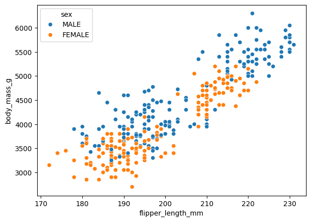
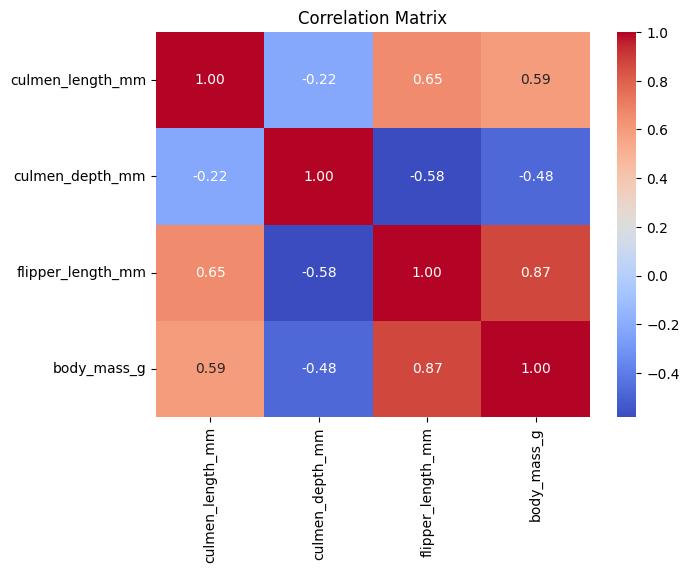
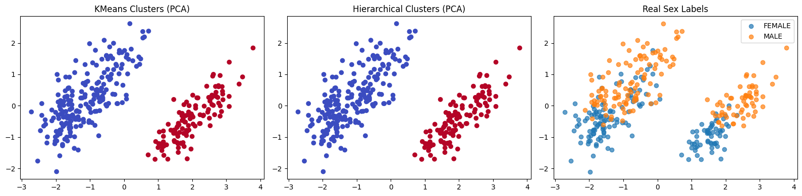

# penguins-classification
Classifying Palmer Penguins species by comparing multiple ML models

## 🐧 Palmer Penguins — Complete Machine Learning Project
A multi-task machine learning project on the Palmer Penguins dataset —covering classification, regression, and unsupervised clusteringwith PCA visualization, comparing multiple models on each task.

## 📌 Project Overview
The Palmer Penguins dataset contains physical measurements for 344 penguinsfrom 3 species collected at Palmer Station, Antarctica.

### This project goes beyond a single model — it explores three ML tasks:

1-Classification — predicting penguin sex from body measurements (6 classifiers)

2-Regression — predicting body_mass_g (4 regressors)

3-Clustering — discovering natural groups (KMeans, Hierarchical, DBSCAN) + PCA visualization

## 📊 EDA Preview




## 📂 Dataset
Source: Kaggle — Palmer Penguins

Size: 344 samples × 7 features

Features: culmen length & depth, flipper length, body mass, island & sex


## ⚙️ Workflow
1-Data Cleaning — handling missing values

2-EDA — feature distributions & relationships

3-Preprocessing — label encoding, feature scaling, train/test split

4-Supervised Learning — classification & regression models

5-Unsupervised Learning — clustering + PCA visualization

## 🤖 Part 1 — Classification: Predicting Sex
|Model	|Accuracy|
|-------|--------|
|`KNN `|	0.955|
|`Random` Forest|	0.910|
|`Logistic Regression`|	0.881|
|`Decision Tree`|	0.866|
|`SVM`|	0.866|
|`Naive Bayes`|	0.731|

## 📈 Part 2 — Regression: Predicting Body Mass
|Model	|R² Score|
|-------|--------|
|`Random Forest `|	0.777|
|`KNN Regressor`	|0.772|
|`Decision Tree`	|0.728|
|`Linear Regression`|	0.720|

## 🔍 Part 3 — Unsupervised Clustering

|Algorithm|	Clusters Found|
|---------|---------------|
|`KMeans (k=2)`	|213 / 119|
|`Hierarchical Clustering`|	213 / 119|
|`DBSCAN (eps=1.2)`	|212 / 119 (+1 noise point)|

KMeans & Hierarchical produced identical splits → a strong natural structure exists in the data.

Cross-tab with sex showed both clusters contain both sexes → clusters are driven by body size, not sex.

The 213/119 split closely matches the species distribution (Gentoo ≈ 124) → clustering rediscovered species structure without any labels.

PCA compressed the features into 2 components keeping 88.4% of total variance.


## 📊 Clusters Visualization
### PCA Clusters



🔑 Key Findings

🏆 Best classifier: KNN — 95.5% accuracy predicting penguin sex

🏆 Best regressor: Random Forest (R² = 0.777)

🧠 Supervised vs Unsupervised insight: models can predict sex with 95.5% accuracy,yet the natural clusters in the data align with body size/species instead of sex —a clear demonstration of how labeled & unlabeled learning see data differently

📉 Naive Bayes was the weakest classifier — its probabilistic assumptions didn't fit this data well

## 🛠 Tools & Technologies
|Tool	|Purpose|
|-----|-------|
|`Python (Pandas, NumPy)`|	Data handling|
|`Scikit-learn`	|ML models, clustering & PCA|
|`Matplotlib / Seaborn`	|Visualizations|
|`Jupyter Notebook`|	Development environment|


## 📂 Project Structure
|File	|Description|
|-----|-----------|
|`penguins_ml_project.ipynb`|	Full analysis & modeling notebook|
|`data.csv`|	Palmer Penguins dataset|
|`requirements.txt`	|Python dependencies|
|`images/pca_clusters.png`|	PCA clusters visualization|


## 🚀 How to Run
```
1-Clone the repository:
git clone https://github.com/abrarma01/palmer-penguins-ml.git

2-Install dependencies: pip install -r requirements.txt

3-Open the notebook: jupyter notebook penguins_ml_project.ipynb
```

## 💡 Future Work
Species classification (the classic task on this dataset) with hyperparameter tuning
Deploy the best model as a web app (Streamlit)


⭐ If this helped you, a star would make my day! 🐧
